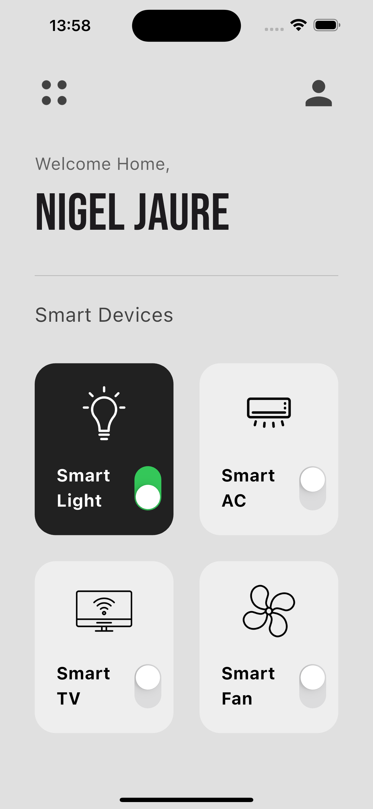

# modern_smart_home_ui

I was following a Flutter tutorial and learning about:

1. GridView
2. Transform
3. UI design

### Flutter tutorial by **Mitch Koko**

 [Link to YouTube](https://www.youtube.com/watch?v=FMV8pbz0sN8&t=27s)

### Outcome
 
